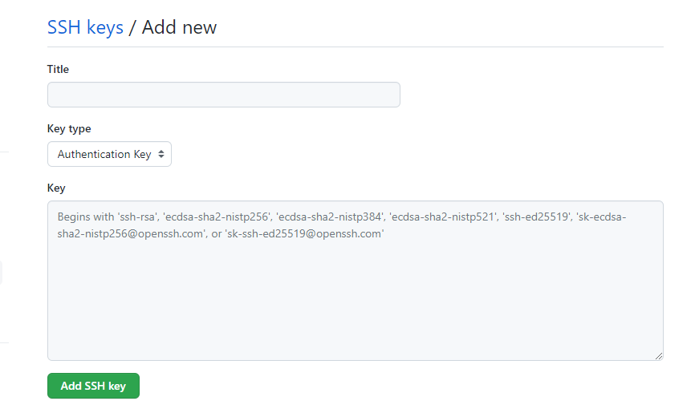

## Git的安装与配置
1.Git下载安装

https://git-scm.com/downloads

2.ssh配置

打开git bash,输入命令
```shell
# demonxinghen@126.com是自己的邮箱
ssh-keygen -t rsa -C "demonxinghen@126.com"
# 执行命令后出现提示
Generating public/private rsa key pair.
# 更换文件来保存密钥, 直接回车跳过
Enter file in which to save the key (/c/Users/demon/.ssh/id_rsa):
# 设置密码, 回车跳过
Enter passphrase (empty for no passphrase):
# 确认密码, 回车跳过
Enter same passphrase again:

# 返回结果, 私钥保存路径
Your identification has been saved in /c/Users/demon/.ssh/id_rsa
# 公钥保存路径
Your public key has been saved in /c/Users/demon/.ssh/id_rsa.pub
The key fingerprint is: ...
```

3.密钥配置

登录github,点击头像-->settings-->SSH and GPG keys-->new SSH key

title随意输入,Key输入刚才id_rsa.pub中的内容,然后点击Add SSH key即可.

4.配置完成就可以通过ssh克隆项目了.

5.提交代码配置用户信息
```shell
# 全局配置用户名
git config --global user.name demonxinghen
# 全局配置邮箱
git config --global user.email demonxinghen@126.com
```

6.仓库级用户信息配置
```text
将5中的--global改为--local, 或者不要, 默认值即为--local,只对本仓库有效
```


已经加入版本控制的文件要移除版本控制
```shell
git rm -r --cached <filename>
git update-index
```
github仓库push或者pull失败的处理方法
```text
报错提示1：【Copilot】Sign in failed. Reason: ... read ECONNRESET, request id: 6, error code: -32603

报错提示2：connect to host github.com port 22: Connection timed out

解放方法,以下两个步骤都要做
查找api.github.com的ip地址，然后在hosts文件中添加
查找github.com的ip地址，然后在hosts文件中添加
查找域名对应ip的网站有很多，比如：https://www.ipaddress.com/
```