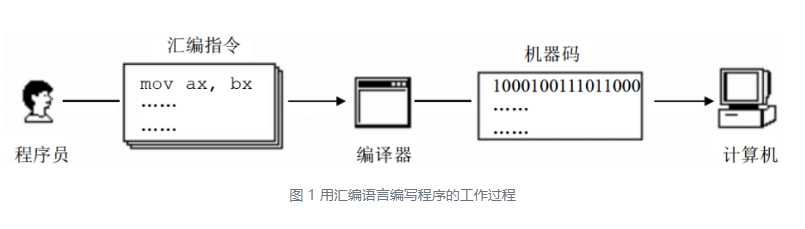

## 第一章 基础知识

汇编语言是直接在硬件之上工作的编程语言.

#### 1.1 机器语言

机器语言是机器指令的集合.机器指令展开来讲就是一台机器可以正确执行的命令.电子计算机的机器指令是一列二进制数字.计算机将之转变为一列高低电平,以使计算机的电子器件收到驱动,进行运算.

CPU(Central Processing Unit,中央处理单元)是一种微处理器.

每一种微处理器,都有自己的机器指令集,也就是机器语言.

#### 1.2 汇编语言的诞生

早起的程序员使用机器语言来设计,编写的程序只有0和1两个数字,难以辨别与记忆,给产业发展带来了障碍,于是汇编语言产生了.

汇编语言的主体是汇编指令.汇编指令和机器指令的差别在于指令的表示方法上.汇编指令是机器指令便于记忆的书写格式.

例如:
```text
操作     把寄存器BX的内容送到AX中
机器指令  1000100111011000
汇编指令  mov ax,bx
```

但是,机器不懂汇编指令,于是就有了编译器,将汇编指令转换成机器指令的翻译程序.



#### 1.3 汇编语言的组成

有以下3类指令组成.

1)汇编指令(核心):机器码的助记符,有对应的机器码

2)伪指令:没有对应的机器码,由编译器执行,计算机并不执行

3)其他符号:如+ - * / 等,由编译器识别,没有对应的机器码

#### 1.4 存储器
CPU控制整个计算机的运作并进行运算,所以需要向CPU提供指令和数据.

指令和数据在存储器中存放,也就是我们平时说的内存.

在一台PC机中,内存的作用仅次于CPU.

磁盘上的数据需要读到内存中,再被CPU使用.

#### 1.5 指令和数据
指令和数据是应用上的概念,在内存或磁盘上,指令和数据没有任何区别,都是二进制信息.

#### 1.6 存储单元
存储器被划分为若干个存储单元,每个存储单元从0开始顺序编号,一个存储器分为128个单元,则编号从0~127.

这些编号可以看做存储单元在存储器中的地址.

一个存储单元可以存储一个Byte(字节),也就是8个bit.
#### 1.7 CPU对存储器的读写
CPU要从内存中读数据,首先要指定存储单元的地址.

另外,一台计算机中,不止有存储器这一种器件.

所以CPU在读写数据时,还要指明,它要对哪一个器件进行操作,进行哪种操作,是读取还是写入.

可见,CPU要进行数据的读写,需要进行下面3类信息的交互.

* 存储单元的地址(地址信息)
* 器件的选择,读或写的命令(控制信息)
* 读或写的数据(数据信息)

CPU通过导线将电信号(也就是上面的3种信息,因为计算器处理/传输的信息都是电信号)传送到存储器芯片中.

在计算机中专门有连接CPU和其他芯片的导线,通常成为总线(一根根导线的集合).

因此,总线在逻辑上分为:
* 地址总线
* 数据总线
* 控制总线

那么,工作流程就是这样的:
```text
CPU从3号单元中读取数据
1.CPU通过地址线将地址信息3发出.
2.CPU通过控制线发出内存读命令,选中存储器芯片,并通知它,将要从中读取数据
3.存储器将3号单元中的数据8通过数据线送入CPU

写入操作类似,都是通过机器码让CPU工作的.
```
#### 1.8 地址总线
一根导线可以传送的稳定状态只有两种,高电平或是低电平,用二进制表示就是1或0.

也就是说10根总线,可以表示2^10=1024个地址.

结论:
```text
一个CPU有N根地址线,则可以说这个CPU的地址总线的宽度为N.这样的CPU最多可以寻找2的N次方个内存单元.
```
#### 1.9 数据总线
8根数据总线一次可以传送一个字节(1Byte,8bit)的数据.

16根数据总线一次可以传送两个字节(2Byte,16bit)的数据.

8080/8088CPU只有8根数据线,8086/80286有16根数据线.

80386有32根数据线.
#### 1.10 控制总线
有多少根控制总线,意味着CPU对外部器件有多少种控制.(我的理解是一根线代表一种控制.)

读或写是通过不同的控制线输出的.

##### 检测点 1.1
```text
(1)8KB=2^13次方,所以地址总线宽度是13.
(2)1024, 0, 1023
(3)1KB=2^10=1024Byte=8192bit
(4)1073741824,1048576,1024
(5)16根=2^16=65536bit=64KB,2^20=1MB,2^24=16MB,2^32=4GB
(6)8根传送1Byte,所以1,1,2,2,4
(7)1024*8=8192bit,8086每次可以读取16bit,所以8086要读512次.
80836可以读32bit,所以80836要读256次.
(8)二进制信息
```

#### 1.11 内存地址空间
内存单元就是CPU的内存地址空间.
#### 1.12 主板
主板上有CPU、存储器、外围芯片组、扩展插槽等器件,这些器件通过总线(地址总线/数据总线/控制总线)相连.

扩展插槽上一般插有RAM内存条和各类接口卡.
#### 1.13 接口卡
CPU通过总线向接口卡发送命令,接口卡根据CPU的命令控制外设(如显示器/音箱/打印机)进行工作.
#### 1.14 各种存储器芯片
* 随机存储器: 可读可写,必须带电存储,关机后内容丢失.
  * 主随机存储器: 主板上的RAM和扩展插槽上的RAM.
  * 接口卡上的RAM,比如显卡上的RAM,称为显存.
* 只读存储器: 只能读取不能写入,关机后内容不丢失.
  * 装有BIOS的ROM
    * 系统BIOS:主板上的BIOS
    * 显卡上的BIOS
    * 网卡上的BIOS
#### 1.15 内存地址空间
上述存储器在物理上是独立的器件,但是都和CPU的总线相连,CPU对他们进行读写的时候都通过控制线发出内存读写命令.

也就是说,CPU把它们都当做内存来对待,整体看成一个逻辑存储器,也就是我们说的内存地址空间.

内存地址空间的大小受CPU地址总线宽度的限制.8086CPU的地址总线宽度为20,则可以定位2^20个内存单位,每个内存单元是1Byte,因此是1MB.

同理80386CPU的地址总线宽度为32,内存地址空间最大为4GB.