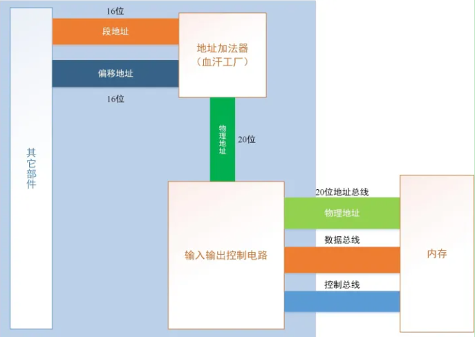
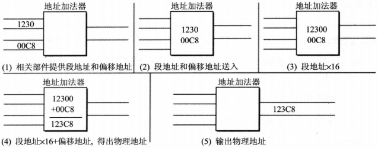

## 第二张 寄存器
一个典型的CPU包括运算器/控制器/寄存器等器件构成,这些器件靠`内部总线`相连.

第一章中提到的地址总线/数据总线/控制总线相对于CPU来说是`外部总线`.

在CPU中:
* 运算器进行信息处理
* 寄存器进行信息存储
* 控制器控制各种器件进行工作
* 内部总线连接各种器件,在它们之间进行数据的传送

寄存器是CPU中程序员可以用指令读写的部件.程序员通过改变各种寄存器中的内容来实现对CPU的控制.

Intel CPU发展史：
参考资料：https://www.cnblogs.com/boyxiao/archive/2010/11/20/1882716.html
内部数据总线等于字长。

| 型号          | 字长 | 地址总线 | 外部数据总线 | 备注                                                                                    |
|-------------|----|------|--------|---------------------------------------------------------------------------------------|
| 4004        | 4  |      |        |                                                                                       |
| 8008        | 8  |      |        |                                                                                       |
| 8080        | 8  |      |        |                                                                                       |
| 8086        | 16 | 20   |        | 进入x86时代                                                                               |
| 8088        | 8  | 20   |        | 由于8086之前都是8位CPU，对应的许多外设也是8位的，于是Intel推出了8086的8位版本8088，从汇编语言角度来说，两者没有任何区别，程序可以不加修改地互相移植 |
| 80186       | 16 | 20   |        | 比8086多了几条指令而已                                                                         |
| 80286       | 16 | 24   |        | 地址总线发生变化                                                                              |
| 80386       | 32 | 32   | 32     | Intel家族32位处理器始于80386，兼容8086/8088，80186，80286                                          |
| 80846       | 32 |      |        |                                                                                       |
| Pentium     | 32 |      | 64     | 第五代微处理器                                                                               |
| Pentium Pro | 32 | 36   |        |                                                                                       |


8086有14个寄存器.

* 通用寄存器(8个) general purpose registers
1. AX 累加器 Accumulator
   * 为了兼容8位机, 又分为AH AL
2. BX 基址寄存器 base register
   * 为了兼容8位机, 又分为BH BL
3. CX 计数器 count register
   * 为了兼容8位机, 又分为CH CL
4. DX 数据存储器 data register
   * 为了兼容8位机, 又分为DH DL
* 变址寄存器
1. SI source index源变址
2. DI destination index目标变址
* 指针寄存器
1. BP base pointer基址指针
2. SP stack pointer堆栈指针

* 段寄存器 segment registers
1. CS 代码段寄存器 code segment register
2. DS 数据段寄存器 data segment register
3. ES 附加段寄存器 extra segment register
4. SS 堆栈段寄存器 stack segment register
* pointer registers
1. IP 指令指针寄存器 instruction pointer
2. FLAG 标志寄存器
#### 2.1 通用寄存器
一个8位寄存器所能存储的数据的最大值为多少?
```text
可存2^8=256个数, 也就是0~255.
```
#### 2.2 字在寄存器中的存储
8086CPU一次性可以处理以下两种尺寸的数据:

* 字节: 记为byte, 8bit, 可以存在8位寄存器中.
* 字: 记为word, 一个字由两个字节组成,分别称为高位字节和低位字节.

```text
通常我们说的32位机, 64位机, 就是指字长为32/64. 8086CPU中字长就是8.
字长: 就是指CPU一次能并行处理的二进制位数,也等同于寄存器的宽度,等同于数据总线(内部数据总线)的宽度.

8088CPU和8086CPU都是16位机器,它们的内部总线宽度都为16,而8088外部总线宽度是8,8086外部总线宽度是16.
```

#### 2.3 几条汇编指令

| 汇编指令      | 控制CPU完成的操作            | 用高级语言的语法描述 |
|-----------|-----------------------|------------|
| mov ax,18 | 将18送入寄存器ax            | ax=18      |
| mov ah,78 | 将78送入寄存器ah            | ah=78      |
| add ax,8  | 将寄存器ax中的值加上8          | ax=ax+8    |
| mov ax,bx | 将寄存器bx的数据送入寄存器ax      | ax=bx      |
| add ax,bx | 将ax和bx中的数据相加,结果存放在ax中 | ax=ax+bx   |
| sub ax,7  | 将ax中的值减去7             | ax=ax-7    |
| inc ax    | ax中的值自增               | ax=ax+1    |
[可以支持简单汇编命令的在线编译器,包括mov/add/sub/inc命令](http://www.eecso.com/test/asm/)

```text
在汇编语言中,汇编指令和寄存器名称不区分大小写.比如mov和MOV,ax和AX都是一样的.

问题2.1的结论:如果高位相加,超过了16,比如8226H+8226H,本来应该等于1044CH,但是由于寄存器AX只能存放4字节,前面的1就被丢弃了(并不是真的丢弃,而是不能保存在这个寄存器中).
```

#### 检测点2.1
(1)如何将10进制的62627转换成16进制数
```text
62627/16=3914,余数为3 
3914/16=244,余数为10
244/16=15,余数为4
15/16=0,余数为15, 所以对应的16进制就是F4A3H
```
mov ax, 62627     AX=`F4A3H`

mov ah, 31H       AX=`31A3H`

mov al, 23H       AX=`3123H`

add ax, ax        AX=`6246H`

mov bx, 826CH     BX=`826CH`

mov cx, ax        CX=`6246H`

mov ax, bx        AX=`826CH`

add ax, bx        AX=`04D8H`

mov al, bh        AX=`0482H`

mov ah, bl        AX=`6C82H`

add ah, ah        AX=`D882H`

add al, 6         AX=`D888H`

add al, al        AX=`D810H`

mov ax, cx        AX=`6246H`

(2)
```text
mov ax, 2H
add ax, ax
add ax, ax
add ax, ax
```
#### 2.4 物理地址
CPU访问内存单元时,需要知道内存单元的地址.所有的内存单元构成的存储空间是一个一维的线性空间.每个内存单元在这个空间中都有唯一的地址,称之为物理地址.

#### 2.5 16位结构的CPU
16位结构与16位机/字长为16位等常见说法,含义相同.

描述了一个CPU具有下面几个特性:

* 运算器一次最多可以处理16位数据
* 寄存器的最大宽度为16位
* 寄存器和运算器之间的通路为16位(这句话也可以说明是内部数据总线宽度.)
#### 2.6 8086CPU给出物理地址的方法
8086CPU有20根地址总线,可以有2^20个地址,但又是16位结构,一次只能传输16位,这样,最多只能寻址2^16个.

于是8086CPU采用在内部用两个16位地址合成的方法来行成一个20位的物理地址.



如上图所示，当8086CPU要读写内存时：

      （1）CPU中的相关部件提供两个16位的地址，一个称为段地址，另一个称为偏移地址；

      （2）段地址和偏移地址通过内部总线，送入一个称为地址加法器的器件的部件；

      （3）地址加法器将两个16位的地址合成为一个20位的物理地址；

      （4）地址加法器通过内部总线，将20位物理地址送入输入输出控制电路；

      （5）输入输出控制电路，将20位物理地址送上地址总线；

      （6）20位物理地址被地址总线传送到存储器。

地址加法器采用物理地址=段地址*16+偏移地址的方法合成物理地址.



```text
为什么段地址是乘以16, 因为地址我们用的是16进制,乘以16相当于二进制左移4位.16位数据总线和20位地址总线也是相差4位.
```

#### 2.8 段的概念
段的来源是由于8086CPU用"基础地址(段地址*16)+偏移地址=物理地址"的方式给出内存单元的物理地址,使得我们可以用分段的方式来管理内存,而并不是说内存分成了一段一段.

偏移地址为16位,也就是寻址能力64KB,所以一个段的最大长度为64KB.

#### 检测点 2.2
(1)段地址位0001H, 那么可寻址范围:基础地址0001H*16=00010H,起始地址即00010H,最大地址位00010+FFFF=1000FH.
(2)因为SA*16+偏移地址=20000H, SA=(20000H-偏移地址)/16,偏移地址范围是0000H-FFFFH,所以SA的最大值是2000H,最小值是(20000H-FFFFH)/16=10001H/16=1001H,因为1000H取不到,所以要加1.

#### 2.10 CS和IP
CS和IP是8086CPU中两个最关键的寄存器,它们指示了CPU当前要读取指令的地址.

CS存放指令的段地址,IP存放指令的偏移地址.

在8086CPU中,任意时刻,设CS中的内容为M,IP中的内容位N,8086CPU将从内存M*16+N单元开始,读取一条指令并执行.

在8086CPU加电启动或复位后,即CPU刚开始工作时,CS和IP被设置为CS=FFFFH,IP=0000H,也就是刚启动时,会从FFFF0H读取指令执行.

CPU将CS:IP指向的内存单元看做指令.

#### 2.11 修改CS/IP的指令

CS/IP的寄存器不能通过mov指令来修改, 8086CPU没有提供这样的功能.

但是提供了jmp指令.

格式:
```text
jmp 段地址:偏移地址 可以同时修改CS和IP
jmp 某一合法寄存器 用该寄存器中的值修改IP
```

#### 小结
8086CPU的执行过程:
1) 先从CS:IP读取指令,读取的指令放入指令缓冲器
2) IP值更新,指向下一条指令
3) 执行指令,然后回到步骤1

#### 检测点2.3
四次修改指令
第一次将mov ax,bx放入指令缓冲器后
第二次将sub ax,bx放入指令缓冲器后
第三次将jmp ax放入指令缓冲器后
第四次在jmp ax执行完之后
最终IP=0000H, 因为第二条命令ax=ax-ax=0000H