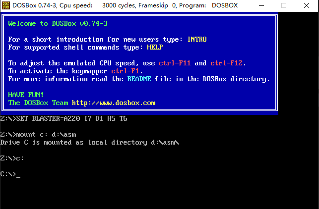

1.DOSBox下载

https://www.dosbox.com/

也可以直接使用目录下的DOSBox0.74-3-win32-installer.exe

2.在D盘下创建目录asm,将debug.exe放入该目录下

3.安装DOSBox0.74-3-win32-installer.exe,并运行,弹出如下画面


根据路径找到该配置文件dosbox-0.74-3.conf,右键编辑,拉倒最底下的


加入以下配置
```shell
mount c: d:\asm
c:
```
最终结果:


4.重新运行DOSBox 0.74-3.exe,看见如下画面则成功.
