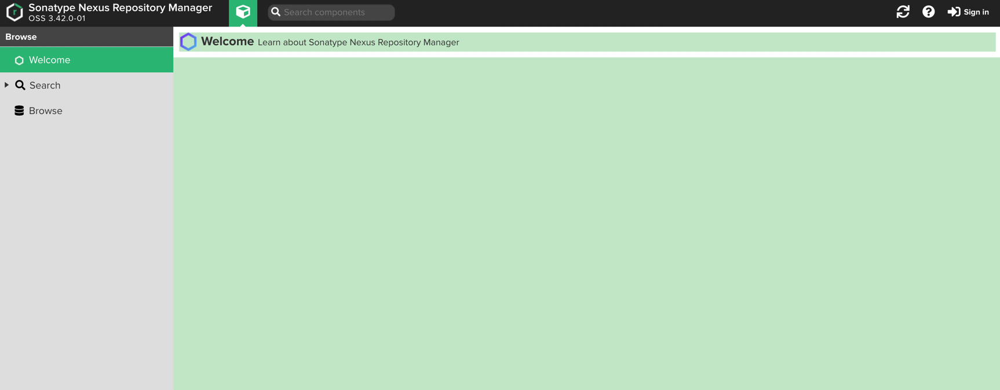
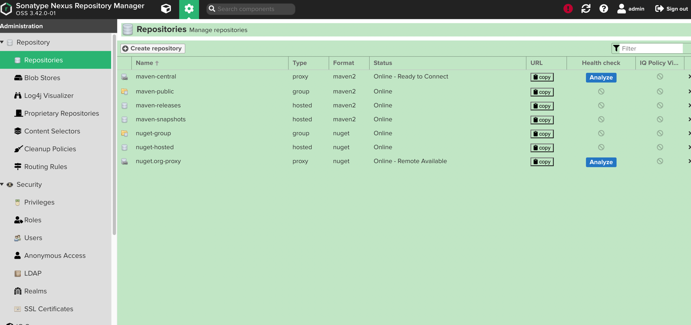

### 下载
官网: https://www.sonatype.com/

下载页面: https://help.sonatype.com/repomanager3/product-information/download

## 运行
### Linux版
解压nexus-3.42.0-01-unix.tar.gz,解压出来有两个目录,分别是:
```text
nexus-3.42.0-01:包含可执行文件、依赖jar包等.
sonatype-work:包含nexus生成的配置文件、日志文件、仓库文件等.
```
目录结构:
```text
.
|-- nexus-3.42.0-01
|   |-- bin
|   |   |-- contrib
|   |   |-- nexus
|   |   |-- nexus.rc
|   |   `-- nexus.vmoptions
|   |-- deploy
|   |-- etc
|   |   |-- fabric
|   |   |-- jetty
|   |   |-- karaf
|   |   |-- logback
|   |   |-- nexus-default.properties
|   |   `-- ssl
|   |-- hs_err_pid26258.log
|   |-- lib
|   |-- NOTICE.txt
|   |-- OSS-LICENSE.txt
|   |-- PRO-LICENSE.txt
|   |-- public
|   |-- replicator
|   |   |-- bin
|   |   `-- nexus-replicator-cli-3.42.0-01.jar
|   `-- system
`-- sonatype-work
    `-- nexus3
        |-- clean_cache
        |-- log
        |-- orient
        `-- tmp
```
进入nexus-3.42.0-01目录,启动nexus
```shell
./nexus start
```
输出了错误:

No suitable Java Virtual Machine could be found on your system.

The version of the JVM must be 1.8.

Please define INSTALL4J_JAVA_HOME to point to a suitable JVM.

说明需要配置java,而且必须要jdk8以上.

本人测试机器,且是centos7,直接执行yum install java.

再次执行./nexus start
```shell
[root@VM-0-11-centos bin]# ./nexus start
WARNING: ************************************************************
WARNING: Detected execution as "root" user.  This is NOT recommended!
WARNING: ************************************************************
Starting nexus
```
说明启动成功了,有个警告,不建议使用root账户来启动.

默认端口为8081,可在nexus-default.properties修改,暂时改为8089.

重启nexus,执行命令./nexus restart

本以为启动成功了,但是一直访问不通,执行命令./nexus status,返回输出
```shell
WARNING: ************************************************************
WARNING: Detected execution as "root" user.  This is NOT recommended!
WARNING: ************************************************************
nexus is stopped.
```
再执行  ./nexus run, 发现了错误提示
```shell
WARNING: ************************************************************
WARNING: Detected execution as "root" user.  This is NOT recommended!
WARNING: ************************************************************
OpenJDK 64-Bit Server VM warning: INFO: os::commit_memory(0x000000074f550000, 1890254848, 0) failed; error='Cannot allocate memory' (errno=12)
#
# There is insufficient memory for the Java Runtime Environment to continue.
# Native memory allocation (mmap) failed to map 1890254848 bytes for committing reserved memory.
# An error report file with more information is saved as:
# /root/nexus-3.42.0-01/hs_err_pid29372.log
```
查看提示给出的log,很明显是内存不足,购买的云服务器只有2G内存
```text
# There is insufficient memory for the Java Runtime Environment to continue.
# Native memory allocation (mmap) failed to map 1890254848 bytes for committing reserved memory.
# Possible reasons:
#   The system is out of physical RAM or swap space
#   The process is running with CompressedOops enabled, and the Java Heap may be blocking the growth of the native heap
# Possible solutions:
#   Reduce memory load on the system
#   Increase physical memory or swap space
#   Check if swap backing store is full
#   Decrease Java heap size (-Xmx/-Xms)
#   Decrease number of Java threads
#   Decrease Java thread stack sizes (-Xss)
#   Set larger code cache with -XX:ReservedCodeCacheSize=
# This output file may be truncated or incomplete.
#
#  Out of Memory Error (os_linux.cpp:2795), pid=29372, tid=0x00007ff69935c700
#
# JRE version:  (8.0_345-b01) (build )
# Java VM: OpenJDK 64-Bit Server VM (25.345-b01 mixed mode linux-amd64 compressed oops)
# Failed to write core dump. Core dumps have been disabled. To enable core dumping, try "ulimit -c unlimited" before starting Java again
```

找到nexus.vmoptions:
```text
-Xms2703m
-Xmx2703m
-XX:MaxDirectMemorySize=2703m
-XX:+UnlockDiagnosticVMOptions
-XX:+LogVMOutput
-XX:LogFile=../sonatype-work/nexus3/log/jvm.log
-XX:-OmitStackTraceInFastThrow
-Djava.net.preferIPv4Stack=true
-Dkaraf.home=.
-Dkaraf.base=.
-Dkaraf.etc=etc/karaf
-Djava.util.logging.config.file=etc/karaf/java.util.logging.properties
-Dkaraf.data=../sonatype-work/nexus3
-Dkaraf.log=../sonatype-work/nexus3/log
-Djava.io.tmpdir=../sonatype-work/nexus3/tmp
-Dkaraf.startLocalConsole=false
-Djdk.tls.ephemeralDHKeySize=2048
```
可以看见默认启动是2703M,修改为1024M.

这回启动成功了,访问页面http://localhost:8089/

## 使用
首先看一下nexus页面:


### 登录
nexus默认匿名访问,右上角sign in登录.

Your admin user password is located in
/root/sonatype-work/nexus3/admin.password on the server.

提示你admin密码所在位置.

登录后会提示你修改密码以及是否要允许匿名访问.

### 仓库
打开设置,查看仓库


列表中已经内置部分仓库,可以看见类型有三种,也就是type这一列,分别是proxy(代理)、hosted(宿主)、group(仓库组).

点击仓库详情，还能看见version policy和url，前者表示该仓库为发布(release)版本还是快照(snapshot)版本或者混合(mixed),后者就是仓库路径。

仓库列表：
```text
maven-central: 代理中央仓库，策略为release
maven-public: 仓库组，整合了maven-central、maven-releases、maven-snapshots
maven-releases: 宿主的release仓库
maven-snapshots: 宿主的snapshot仓库
nuget-group: 微软NuGet,是Visual Studio的扩展，不管它
nuget-hosted:
nuget.org-proxy:
```
部分配置解释
```text
Layout policy: 布局策略。
    strict：严格检查
    permissive：不检查
Content Disposition: 内容部署
Blob store: 大文件存储
Strict Content Type Validation: 严格的content-type校验
Deployment policy: 仓库的部署策略。
    Allow redeploy 允许重新部署
    Disabled redeploy 关闭重新部署(只能部署一次)
    Read-only 只读，禁止部署
    Deploy by Replication only 仅通过复制部署
Propietary Components: 专用组件
Remote storage: 远程仓库的地址
Maximum metadata age: 元数据最大时间，也就是元数据更新时间间隔
Routing rule: 路由规则
Not found cache enabled: 没有找到是否启用缓存
Not found cache ttl: 缓存有效期
```

## 配置
maven下的settings.xml，修改profile配置