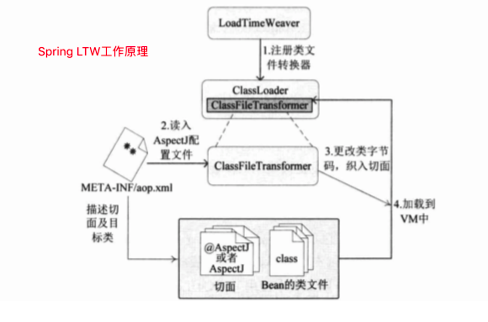

### AOP：面向切面编程
通过为目标类织入切面的方式，实现对目标类功能的增强。

按时间划分：
* 运行期织入：Spring使用的jdk动态代理和cglib代理
* 编译期织入：需要特殊的编译器，少见
* 加载期织入：在目标类的class文件被jvm加载前，通过自定义类加载器或者类文件转换器将逻辑织入到class文件，然后将修改后的class文件交给jvm加载，这种方式被称为LTW(LoadTimeWeaving)。

### @EnableLoadTimeWeaving
通过这个注解启用加载时织入

既可以使用AspectJ语法定义的切面，也可以使用@AspectJ注解

Spring通过读取classpath下的META-INF/aop.xml文件，获取切面类和目标类

工作原理见图

