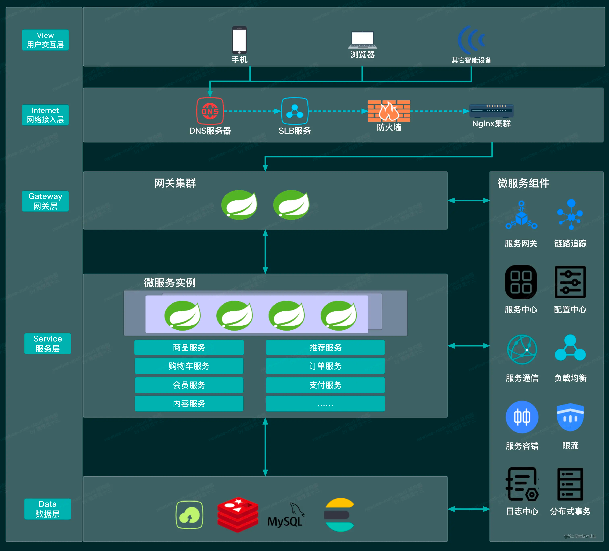

可以看出，用户从入口手机、pc浏览器和其他智能设备发起请求，这些请求全部聚集到网关(GateWay),网关收到请求后根据配置中心和注册中心分发到不同的微服务实例。

在这个过程中，还有其他的微服务组件，比如链路追踪，服务监控，负载均衡，限流等。

拆成微服务的好处，单体应用分解成多个应用，单应用的代码量降低，可维护性增高，单个应用不会影响其他项目，单个应用可以使用不同的数据库和编程语言，在集群部署时，也可以针对不同应用部署不同数量。

| 技术        | Spring Cloud官方套件或第三方套件     | Alibaba套件 | Netflix套件 |
|-----------|----------------------------|-----------|-----------|
| 服务注册与服务发现 | Consul、Zookeeper           | Nacos     | Eureka    |
| 配置中心      | Spring Cloud Config        | Nacos     |           |
| 服务通信      | Open Feign                 | Dubbo     | Feign     |
| 负载均衡      | Loadbalancer               |           | Ribbon    |
| 服务网关      | Spring Cloud Gateway       |           | Zuul      |
| 断路器       | Resilience4j               | Sentinel  | Hystrix   |
| 链路追踪      | Spring Cloud Sleuth、Zipkin |           |           |
| 分布式事务     |                            | Seata     |           |
