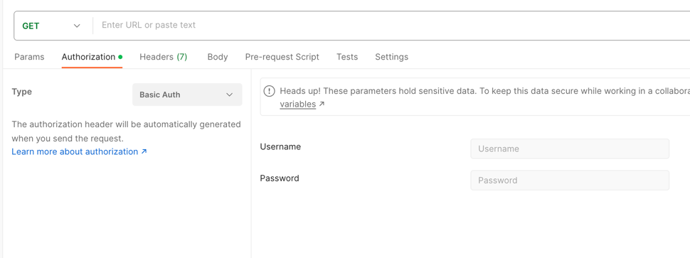
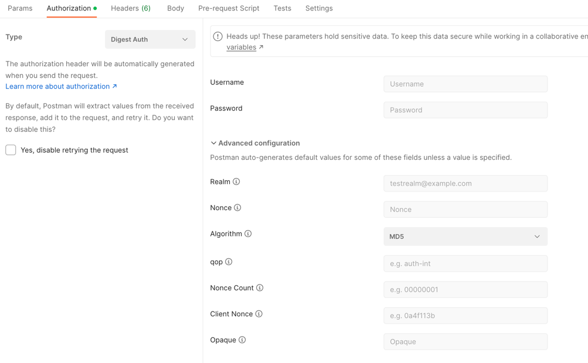

### 认证(authentication)
你是谁,用户认证
### 授权(authorization)
能干嘛,权限校验

### 用户认证
* 基础认证: BASIC Auth,HTTP协议标准提供
* 摘要认证: DIGEST认证,和基本认证类似,HTTP协议标准提供
* SSL客户端认证: 过于复杂,实际使用不多
* 基于表单认证: FormBase认证,不是HTTP协议提供

### HTTP基础认证
通过HTTP协议的Authorization消息头携带用户名和密码进行验证

明文传输密码(即使使用Base64也是明文,因为Base64只是编码方式)

### 摘要认证
摘要的对象是客户端参数和服务端响应，即在请求-应答式交互过程中，需要站在发生交互的客户端和服务端双方分别判断对方是否合法。摘要认证的过程也比较简单，即通过 MD5 或 SHA 算法结合加盐机制进行摘要的生成和比对来判断信息是否被篡改。

摘要认证过程：客户端访问HTTP资源服务器,服务器返回nonce(随机数,只能被服务端使用一次)和realm两个参数.有了这两个参数之后，客户端就可以根据用户输入的用户名和密码来构造Authorization请求头.

### 表单认证
表单页面输入用户名和密码,提交给服务器验证。

