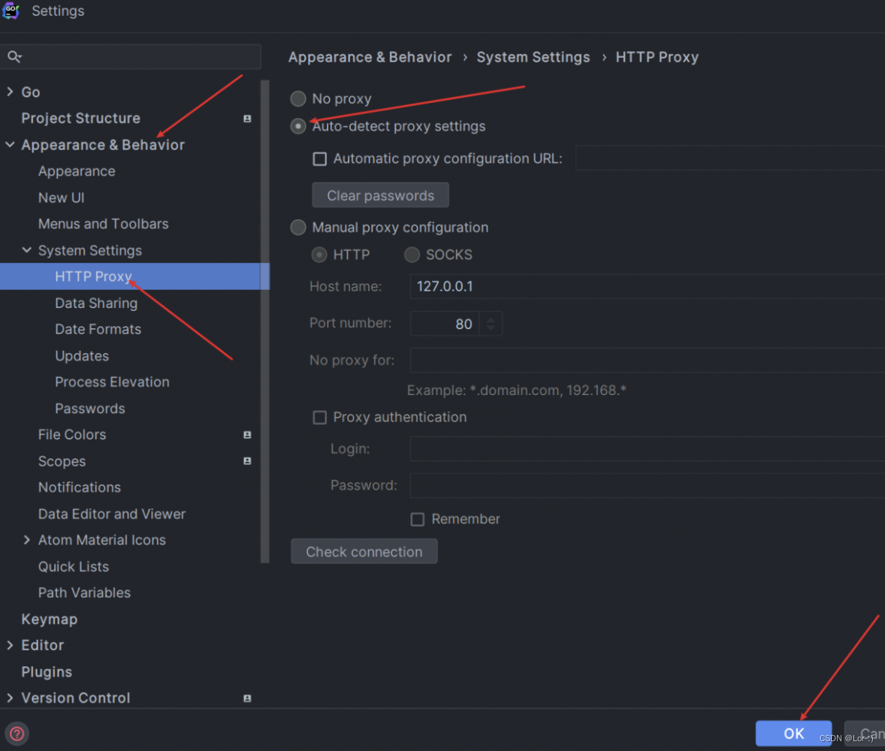

由于地区受限，无法使用AI Assistant，所以需要魔法

系统开启全局代理或者规则代理

### 规则代理配置（Clash For Windows）

在profiles里右键打开Parsers, 添加如下配置

```yaml
parsers: # array
  - url: https://update.cdn-sd.xyz/api/v1/client/subscribe?token=d879574f1544a3760a698ef2f02c78d8
    yaml:
      prepend-proxy-groups:
        - name: JetBrainsAi
          type: select
          proxies: 
            - Lv3 新加坡 01 [2.0]
            - Lv3 新加坡 02 [2.0]
            - Lv3 新加坡 03 [2.0]
            - Lv3 新加坡 04 [2.0]
            - Lv3 新加坡 05 [2.0]
            - Lv3 新加坡 06 [2.0]
      prepend-rules:
        - DOMAIN-KEYWORD,grazie.aws.intellij.net,JetBrainsAi
        - DOMAIN-KEYWORD,grazie.ai,JetBrainsAi
```

解释：
```text
parsers: # array 默认开头，固定的
- url, 后面跟的是订阅地址，也就是在更新这个地址的配置文件时会预先加入下面的yaml配置
yaml固定前缀
prepend-proxy-groups表示需要预先设置的代理组，name就是组名，type就是选中的代理节点，proxies就是对应的节点
prepend-rules表示预先设置的规则，由三部分组成，DOMAIN-KEYWORD表示域名关键字匹配，grazie.aws.intellij.net就是对应的域名关键字，JetBrainsAi就是上面定义的组名，意思就是域名匹配上了这个关键字，就使用JetBrainsAi对应的代理节点
```

yaml对应的配置有：

| 键                    | 值类型 | 操作                       |
|----------------------|-----|--------------------------|
| append-rules         | 数组  | 数组合并至原配置rules数组后         |
| prepend-rules        | 数组  | 数组合并至原配置rules数组前         |
| append-proxy-groups  | 数组  | 数组合并至原配置proxy-groups数组后  |
| prepend-proxy-groups | 数组  | 数组合并至原配置proxy-groups数组前  |
| append-proxies       | 数组  | 数组合并至原配置proxies数组后       |
| prepend-proxies      | 数组  | 数组合并至原配置proxies数组前       |
| mix-proxy-providers  | 对象  | 对象合并至原配置proxy-providers中 |
| mix-rule-providers   | 对象  | 对象合并至原配置rule-providers中  |
| mix-object           | 对象  | 对象合并至原配置最外层中             |
| commands             | 数组  | 在上面操作完成后执行简单命令操作配置文件     |

规则类型有：

| 键              | 描述                 |
|----------------|--------------------|
| DOMAIN-SUFFIX  | 域名后缀匹配             |
| DOMAIN         | 域名匹配               |
| DOMAIN-KEYWORD | 域名关键字匹配            |
| IP-CIDR        | IP 段匹配             |
| SRC-IP-CIDR    | 源 IP 段匹配           |
| GEOIP          | GEOIP 数据库（国家代码）匹配  |
| DST-PORT       | 目标端口匹配             |
| SRC-PORT       | 源端口匹配              |
| PROCESS-NAME   | 源进程名匹配             |
| RULE-SET       | Rule Provider 规则匹配 |
| MATCH          | 全匹配                |

clash for windows文档可查看： https://docs.gtk.pw/

### 配置完需要更新下订阅，规则才能生效

### 修改账号的所在地区
在下面链接中修改账号所在地区： https://account.jetbrains.com/profile-details

### IDE设置开启代理



将IDE的HTTP PROXY设置为Auto-detect proxy settings，这样操作后就会自动使用系统的代理设置，如果你不设置代理，亲测AI助手还是无法使用。

### 接下来就可以正常使用了