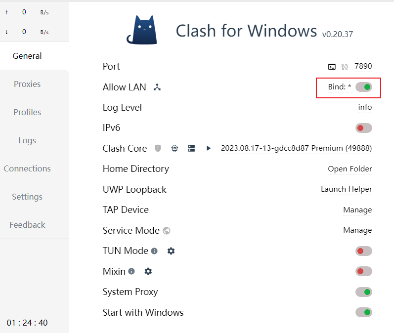

搭建环境 centos9

### 安装docker
[安装docker](../09-操作系统/04-Docker/01-CentOS搭建Docker.md)

### 安装Anaconda3
下载 https://www.anaconda.com/download
```shell
wget https://repo.anaconda.com/archive/Anaconda3-2024.02-1-Linux-x86_64.sh
chmod +x Anaconda3-2024.02-1-Linux-x86_64.sh
bash Anaconda3-2024.02-1-Linux-x86_64.sh
# 查看license, 输入yes, 确定安装路径
# 当询问是否将Anaconda添加到环境变量时，通常建议选择 yes ，这样Anaconda和Conda的bin目录会被自动加入到您的.bashrc或.zshrc等shell配置文件中，以便在新的shell会话中自动激活Anaconda环境。
# 关闭/重启终端
```

### 安装python
```shell
# py311是你给新环境起的名字,python=3.11,表示要安装Python3.11版本。
conda create -n py311 python=3.11
# 激活环境
conda activate py311
# 查看python版本
python --version
# 退出环境
conda deactivate
```
### 安装Poetry
```shell
curl -sSL https://install.python-poetry.org | python3 -
# 升级poetry
poetry self update
# 测试poetry安装完成
poetry --version
```
### 安装make
```shell
sudo yum install make -y
```
### 安装nvm
安装连接 https://nvm.uihtm.com/#nvm-linux
```shell
cd ~
wget https://github.com/nvm-sh/nvm/archive/refs/tags/v0.39.1.tar.gz
mkdir -p .nvm
tar -zxvf v0.39.1.tar.gz -C .nvm
vim ~/.bashrc
```
在.bashrc中添加以下内容
```shell
export NVM_DIR="$HOME/.nvm/nvm-0.39.1"
[ -s "$NVM_DIR/nvm.sh" ] && \. "$NVM_DIR/nvm.sh"  # This loads nvm
[ -s "$NVM_DIR/bash_completion" ] && \. "$NVM_DIR/bash_completion"  # This loads nvm bash_completion
```
使配置生效
source ~/.bashrc
### 安装node
```shell
# 查看可用的node版本
nvm ls-remote --lts | tail -n 10
nvm install v20.12.1
```
### 安装OpenDevin
#### 拉取项目
```shell
git clone https://github.com/OpenDevin/OpenDevin.git
cd OpenDevin
```
#### 安装依赖
```shell
make build
```
tips: 此时遇到下载比较慢,因为用的vmware安装的虚拟机

vmware虚拟机走主机clash for windows代理

1. 虚拟机设置-网络适配器-桥接模式(不要复制物理网络连接状态)

2. 主机查看IP,ipconfig找到ipv4地址

3. clash for windows打开Allow LAN开关,记住端口


4. 进入虚拟机,打开网络设置,配置如下,ip是步骤2主机ip,端口是步骤3里的Port


5. 浏览器可成功使用代理
```text
如果浏览器无法使用代理,请打开terminal窗口,先ping主机ip是否成功,再telnet 主机ip 步骤3port
如果telnet不通,有可能被防火墙拦截,请检查防火墙设置

windows11防火墙增加入站规则
1. 打开Windows Defender Firewall
2. 右侧Advanced settings
3. 点击Inbound Rules -> New Rule -> Port -> TCP, Specific local ports填入7890 -> Allow the connection -> Next -> 勾选网络,默认全选 -> Next -> 填写规则名称 -> Finish
```
pip install可以修改全局镜像源配置
```shell
mkdir -p ~/.pip
echo "[global]" >> ~/.pip/pip.conf
echo "index-url = https://pypi.tuna.tsinghua.edu.cn/simple" >> ~/.pip/pip.conf
```
或者
```shell
pip config set global.index-url https://pypi.tuna.tsinghua.edu.cn/simple/
# 还原官方源
pip config set global.index-url https://pypi.org/simple/
```
或者单个下载
```shell
pip install -i https://pypi.tuna.tsinghua.edu.cn/simple <package_name>
pip install -i https://mirrors.aliyun.com/pypi/simple <package_name>
# 如果要带包版本
pip install -i https://pypi.tuna.tsinghua.edu.cn/simple <package_name==package_version>
```
#### 配置语言模型
```shell
make setup-config
```
根据提示配置语言模型,支持的模型可见 https://docs.litellm.ai/docs/providers

#### 启动
```shell
make run
# 只启动后端
make start-backend
# 只启动前端
make start-frontend
# 帮助
make help
```
出现报错信息
```text
 File "/home/demon/anaconda3/envs/py311/lib/python3.11/site-packages/toml/decoder.py", line 514, in loads
    raise TomlDecodeError(str(err), original, pos)
toml.decoder.TomlDecodeError: Duplicate keys! (line 5 column 1 char 158)
make: *** [Makefile:111：start-backend] 错误 1
```
是由于config.toml中出现了重复key,删掉即可
报错2
```text
  File "/home/demon/anaconda3/envs/py311/lib/python3.11/site-packages/requests/adapters.py", line 519, in send
    raise ConnectionError(e, request=request)
requests.exceptions.ConnectionError: HTTPConnectionPool(host='localhost', port=5001): Max retries exceeded with url: /v1//api/embeddings (Caused by NewConnectionError('<urllib3.connection.HTTPConnection object at 0x7f7738809310>: Failed to establish a new connection: [Errno 111] Connection refused'))
```
后端服务启动有问题,5001端口没有正常启动