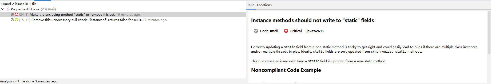

### 场景
有时候在编写工具类的时候,希望实现Spring的Aware接口,并且提供静态方法供其他类直接调用.

本例就是提供一个工具类可以在普通类中直接获取spring属性.
```java
@Component("propertiesUtil")
public class PropertiesUtil implements BeanFactoryAware {

    private static BeanFactory beanFactory;

    public static String getSelfDomain(String value){
        if (beanFactory instanceof ConfigurableBeanFactory){
            ConfigurableBeanFactory factory = (ConfigurableBeanFactory) beanFactory;
            return factory.resolveEmbeddedValue(value);
        }
        return null;
    }

    @Override
    public void setBeanFactory(BeanFactory appBeanFactory) throws BeansException {
        beanFactory = appBeanFactory;
    }
}
```
使用SonarLint扫描会提示Instance methods should not write to "static" fields.
Correctly updating a static field from a non-static method is tricky to get right and could easily lead to bugs if there are multiple class instances and/or multiple threads in play. Ideally, static fields are only updated from synchronized static methods.
大致意思就是不应该在实例方法中给静态变量赋值,在多实例或者多线程的情况下容易导致bug,静态变量只能在synchronized static方法中更新.



### 解决方法1: 类上添加注解@SuppressWarnings("squid:S2696") 或者 @SuppressWarnings("java:S2696")
```java
@SuppressWarnings("java:S2696")
@Component("propertiesUtil")
public class PropertiesUtil implements BeanFactoryAware {
    
}
```
squid是SonarQube的uid,但是SonarQube不止适用于java,所以也可以使用java来细分语言,也就是squid:S2696还可能适用于其他语言,所以范围更大.

S2696是怎么来的呢? 上图中右边Rule中有一行Code Smell Critical java:S2696, 最后一个就是uid.

### 解决方法2: 修改方法
```java
@Component("propertiesUtil")
public class PropertiesUtil implements BeanFactoryAware {

    private static BeanFactory beanFactory;

    public static String getSelfDomain(String value) {
        if (beanFactory instanceof ConfigurableBeanFactory) {
            ConfigurableBeanFactory factory = (ConfigurableBeanFactory) beanFactory;
            return factory.resolveEmbeddedValue(value);
        }
        return null;
    }

    @Override
    public void setBeanFactory(BeanFactory appBeanFactory) throws BeansException {
        setStaticBeanFactory(appBeanFactory);
    }

    public static synchronized void setStaticBeanFactory(BeanFactory appBeanFactory) {
        if (beanFactory == null) {
            beanFactory = appBeanFactory;
        }
    }
}
```