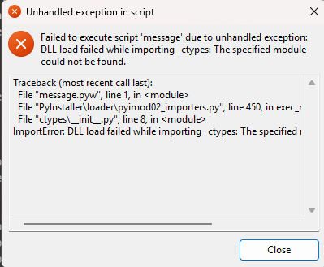

1.安装官方python,不要使用Anaconda

2.安装pip

3.安装PyInstaller
```shell
pip install PyInstaller
```
4.将py脚本保存为pyw格式,pyw格式是python的无窗口模式,适合图形界面或弹窗工具

5.使用PyInstaller打包
```
C:\Python312\python.exe -m PyInstaller --noconsole --onefile --clean message.pyw
```
或者指定python版本
```shell
py -3.12 -m PyInstaller --noconsole --onefile --clean message.pyw
```

6.打包完成后,在dist目录下会生成一个exe文件,双击即可运行

7.删除多余的文件,比如build目录,*.spec



出现该异常,一般是使用了Anaconda的Python来打包,但打包环境不完整或不兼容（Anaconda 的 Python 环境对打包来说太“特殊”）。依赖的 DLL（如 libffi）丢失或无法在打包时正确复制。

解决方法:使用官方的Python环境来打包