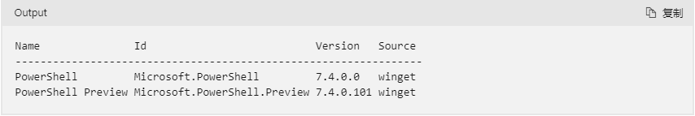
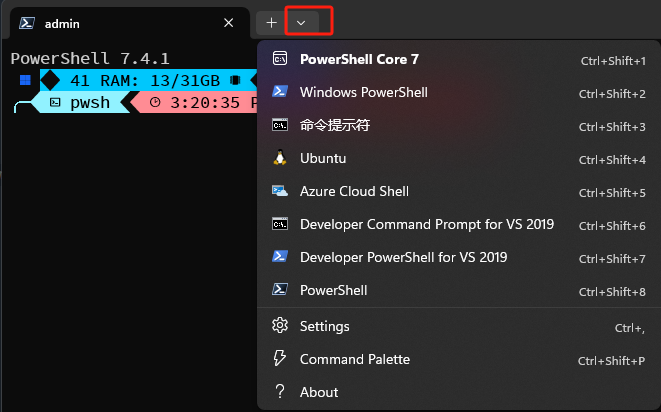

### 下载powershell7
搜索最新版本的powershell,需梯子
```shell
winget search Microsoft.PowerShell
```

安装指定版本
```shell
winget install --id Microsoft.Powershell --source winget
# 安装预览版 winget install --id Microsoft.Powershell.Preview --source winget
```
### 字体下载
https://www.nerdfonts.com/font-downloads

本次安装的是hasklig,下载后的zip包内文件解压后存放到路径C:\Windows\Fonts（注意：不要复制txt和md文件）
### 设置
具体配置可见官网：https://learn.microsoft.com/zh-cn/windows/terminal/customize-settings/profile-appearance

打开powershell7配置文件，点击settings

左下角Open JSON file

修改配置
```json lines
{
  "defaultProfile": "{1e2513b2-d388-4eb8-8255-c97c02107f64}", // 需要激活使用的profile,与下面list中的guid保持一致
  "profiles": {
    "defaults": {
      "font": {
        "face": "Hasklug Nerd Font Mono" // 设置的字体,也就是上面的下载的字体
      }
    },
    "list": [
      {
        "adjustIndistinguishableColors": "always", // 调整不可区分的颜色,会根据背景色自动调整前景色,增加其可见度
        "commandline": "C:\\Program Files\\PowerShell\\7\\pwsh.exe", // powershell7的路径
        "guid": "{1e2513b2-d388-4eb8-8255-c97c02107f64}", // 自己随便生成,不和其他的冲突就行
        "hidden": false,
        "name": "PowerShell Core 7",
        "opacity": 50, // 不透明度
        "useAcrylic": true, // 应用不透明度
        "startDirectory": "C:\\" // 终端打开的默认路径
      }
    ]
  }
}
```
### 安装posh-git和oh-my-posh
```shell
winget install JanDeDobbeleer.OhMyPosh -s winget
Install-Module posh-git -Scope CurrentUser
Install-Module oh-my-posh -Scope CurrentUser
Install-Module DirColors -Scope CurrentUser
```

### 设置修改powershell的配置文件
```shell
if (!(Test-Path -Path $PROFILE )) { New-Item -Type File -Path $PROFILE -Force }

notepad $PROFILE
```
执行notepad $PROFILE打开的文本中输入：
```text
Import-Module PSReadLine

Set-PSReadlineKeyHandler -Key Tab -Function Complete
Set-PSReadLineKeyHandler -Key "Ctrl+d" -Function MenuComplete
Set-PSReadLineKeyHandler -Key "Ctrl+z" -Function Undo
Set-PSReadLineKeyHandler -Key UpArrow -Function HistorySearchBackward
Set-PSReadLineKeyHandler -Key DownArrow -Function HistorySearchForward

Import-Module DirColors

oh-my-posh init pwsh --config "$env:POSH_THEMES_PATH/if_tea.omp.json" | Invoke-Expression
```
保存后退出,终端输入命令,使配置文件生效
```shell
$PROFILE
```
```text
tips: if_tea.omp.json是本次应用的主题,如果要换主题,请访问 https://ohmyposh.dev/docs/themes
```

### 参考Windows11PowerShellVScode美化设置conda环境名-知乎.pdf